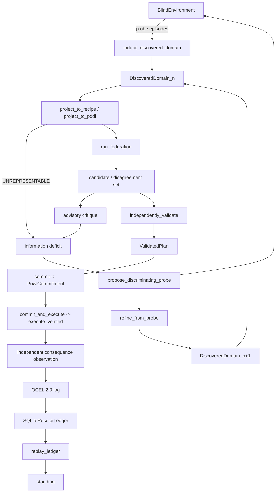

# Level 4 Discovery Architecture

Every standing claim in this document is a `technicalStanding` claim in the sense of
`.claude/rules/standing-law.md`. Nothing in this subsystem computes `organizationalStanding`.

## Executive summary

This document describes the Level 4 discovery subsystem: the code path that starts from an
environment whose dynamics are *not* given, probes it, induces a causal domain description,
projects that description into forms planners can consume, runs a federation of real registered
solvers over it, critiques the disagreement, probes again to resolve what the critique showed was
undetermined, and — only after an independent validation and an explicit commitment step —
actuates and records a replayable receipt chain.

It is for engineers extending the `gym_procedure` hub domain, and for reviewers who need to know
exactly which link in that chain carries evidence and which does not. Every module named below
exists on disk under
`../src/autofde_lab/hub/domain/gym_procedure/`.

The distinguishing property is negative: no stage in this pipeline is permitted to assume the
procedure has already been chosen, and no advisory stage is permitted to actuate. Both constraints
are enforced by types, not by convention, and both are documented in their own sections below.

## The pipeline

```text
probe
  -> DiscoveredDomain_n
  -> projections (each may return UNREPRESENTABLE)
  -> planner federation
  -> candidate / disagreement set
  -> advisory critique
  -> information deficit
  -> discriminating probe
  -> DiscoveredDomain_n+1
  -> independently validated plan
  -> POWL commitment
  -> execute_verified
  -> independent consequence observation
  -> OCEL
  -> receipt
  -> replay
  -> standing
```



### Modules, in pipeline order

- `discovered_domain.py` — the causal intermediate representation. Types `DiscoveredDomain`,
  `DiscoveredProblem`, `DiscoveredAction`. Entry point `induce_discovered_domain` builds the
  domain from probe logs. `propose_discriminating_probe` and `refine_from_probe` implement the
  causal-refinement loop. `project_to_recipe` and `project_to_pddl` are the two projections.
- `state_typing.py` — `DimensionKind` with the six kinds `BOOLEAN`, `CATEGORICAL`, `INTEGER`,
  `CONTINUOUS`, `OBJECT_VALUED`, `UNKNOWN`; `classify_observation` assigns them;
  `propositionalize` refuses lossy dimensions with `UNREPRESENTABLE:<reason>`.
- `level4_gymact_bridge.py` — `RealBlindEnvironment`, a subprocess bridge into the sibling
  repository's virtual environment at `/Users/sac/gymact/.venv`, driving real GymAct episodes.
  This is the source of real observations, not a simulator of them.
- `planner_federation.py` — `classify_registered_solvers` enumerates the real
  `autofde_lab.solvers` entry-point group and calls each solver's real `check_domain()`.
  `run_federation` runs the supported ones and returns a `PlannerAttempt` for **every** attempt,
  including the failures.
- `level4_crown.py` — advisory critique; `independently_validate` returning `ValidatedPlan`;
  `commit` returning `PowlCommitment`; `commit_and_execute` as the sole actuation path;
  `validate_ocel_referential_integrity`.
- `level4_crown_runner.py` — `freeze_crown`, `load_crown`, `verify_manifest`, `CrownAttempt`,
  `CrownRun`: the frozen-protocol runner with mechanical anti-cheating enforcement.
- `level4_generator.py` — `Trial` (a `uuid4` run id plus an isolated evidence directory), a
  synthetic `BlindEnvironment`, and `verify_trial`.

## Why DiscoveredDomain, not Recipe

A `Recipe` presupposes that a procedure has already been selected. It names steps in an order and
asserts that performing them accomplishes something. That is the *output* of a selection, and
treating it as the input silently smuggles in the answer the subsystem is supposed to compute.

Level 4 must discover causal structure *before* selecting a procedure. `DiscoveredDomain` is
therefore the primary representation: a set of `DiscoveredAction` records with induced
preconditions and effects, plus a `DiscoveredProblem` giving initial and goal conditions. A recipe
is one *projection* of it (`project_to_recipe`), a PDDL domain/problem pair is another
(`project_to_pddl`), and each projection is allowed to fail with `UNREPRESENTABLE` when the target
formalism cannot carry what was discovered. A projection that cannot fail is a projection that
lies.

## Correlation is not causation

Induction from probe logs, done naively, takes the intersection of the conditions present whenever
an action succeeded and calls that the precondition. This is a correlational hypothesis, and it is
wrong exactly when the probe distribution is confounded.

Measured worked example, run this session: a probe log in which conditions `A`, `B`, and `C`
always co-occur, but only `B` is causally required. Naive intersection induction yields the
precondition set `{A, B, C}` — consistent with every observation and still wrong. Two successive
calls to `refine_from_probe`, each fed an episode chosen by `propose_discriminating_probe`, shrink
the set to exactly `{B}`.

The mechanism is that `propose_discriminating_probe` does not sample more of the same
distribution; it selects an episode whose outcome differs between the competing hypotheses. That
is what breaks the confound. A discovery loop without a discriminating-probe step converges on
whatever its probe distribution happened to correlate, and no amount of additional passive data
fixes it.

`technicalStanding` of the refinement loop on this example: `ALIVE`.

## Typed state dimensions

`classify_observation` assigns every observation dimension one of six kinds:

| Kind | Meaning |
|---|---|
| `BOOLEAN` | Two-valued; directly a propositional atom. |
| `CATEGORICAL` | Finite unordered domain; encodable as mutually exclusive atoms. |
| `INTEGER` | Ordered discrete; encodable when bounded. |
| `CONTINUOUS` | Real-valued; not soundly encodable propositionally. |
| `OBJECT_VALUED` | A reference to a structured entity, not a scalar. |
| `UNKNOWN` | Classification could not be established. |

Two design points that are easy to get wrong:

**`bool` is checked before `int`.** In Python `bool` is a subclass of `int`, so an `isinstance`
chain that tests `int` first classifies every boolean as `INTEGER` and then encodes it as a
bounded numeric range. On the real live observation
`{counter: int, target: int, reward: float, solved: bool}`, `solved` classifies as `BOOLEAN`
because the boolean test runs first.

**A continuous dimension returns `UNREPRESENTABLE` rather than being propositionalized.** On the
same real observation, `reward` classifies as `CONTINUOUS` and `propositionalize` reports
`UNREPRESENTABLE:CONTINUOUS_DIMENSION_HAS_NO_SOUND_PROPOSITIONAL_ENCODING`. No `reward=` atom is
emitted. The alternative — discretizing into bins and emitting atoms anyway — produces a planning
problem whose solutions are valid in the encoding and unsound in the environment. A refusal is
recoverable; a confident wrong plan admitted downstream is not. This is the same principle as the
PDDL requirements gate described in `../CLAUDE.md`.

## Authority boundary

Three verbs, three distinct authorities, never collapsed:

- **SELECT** — a planner proposes. Output is advisory. It has no bearer authority.
- **CONSTRUCT** — a validator and a committer turn an advisory proposal into a bearer artifact.
- **DO** — an executor actuates a bearer artifact and observes the consequence independently.

The separation is carried by the type chain, not by discipline:

```python
# advisory -> bearer -> actuation; each arrow is a real function, not a convention
validated: ValidatedPlan = independently_validate(candidate, ...)
commitment: PowlCommitment = commit(validated, ...)
result = commit_and_execute(commitment, ...)   # the ONLY actuation path
```

`commit_and_execute` accepts a `PowlCommitment` and nothing else. A raw planner output — a plain
plan tuple — cannot reach actuation, because there is no path from advisory output to
`PowlCommitment` that bypasses `independently_validate` and `commit`. Passing the raw tuple
directly produces the typed refusal `ADVISORY_AUTHORITY_USED_AS_BEARER`, observed firing for real
this session.

This is the local instantiation of the repository-wide rule in `../CLAUDE.md`: a planner selects,
a broker authorizes, an executor performs, a verifier evaluates. Advisory output structurally
cannot actuate.

## What this does NOT claim

- **No POWL workflow execution.** `PowlCommitment` and the emitted `commitment.ttl` are bearer
  artifacts. Nothing in this subsystem executes a POWL workflow end to end; see
  `ecosystem-standing.md`.
- **No BRCE in this repository.** Actuation here runs through gymact's kernel via
  `level4_gymact_bridge.py`. BRCE belongs to other systems in the portfolio and has no role here.
- **No `organizationalStanding`.** Every status in this document is `technicalStanding`. No
  component computes accountable customer acceptance.
- **The Level 4 crown has not been run.** `level4_crown_runner.py` exists and its manifest
  tampering check has been observed firing, but the frozen run of at least ten trials has not
  executed. Standing of the crown: `UNKNOWN`.
- **A known real defect is open.** `execute_verified` checks the same expected postcondition after
  every actuation, so intermediate steps of a multi-step plan are correctly `REFUSED`. Per-step
  predicted postconditions are the fix; that repair is in progress and is not complete.

## See Also

- `2026-08-08-level4-crown-progress.md` — the measured experiment record for this subsystem.
- `STATUS.md` — the in-repo working ledger.
- `ecosystem-standing.md` — the cross-repository standing ledger.
- `../CLAUDE.md` — repository index, the four inline rules, and the build/test commands.
